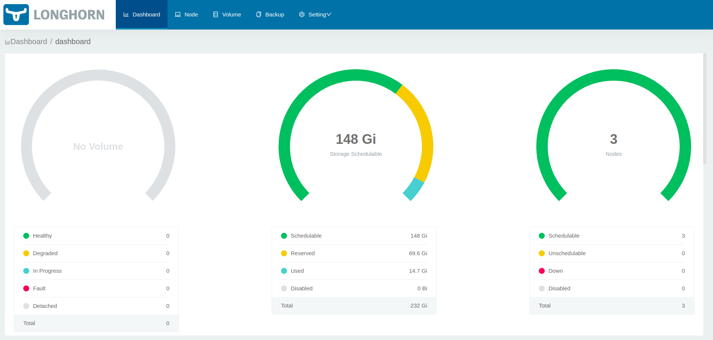
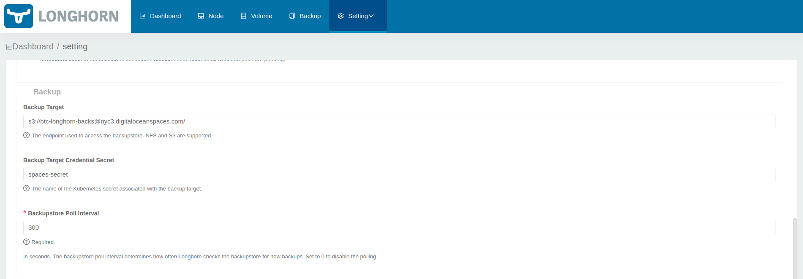
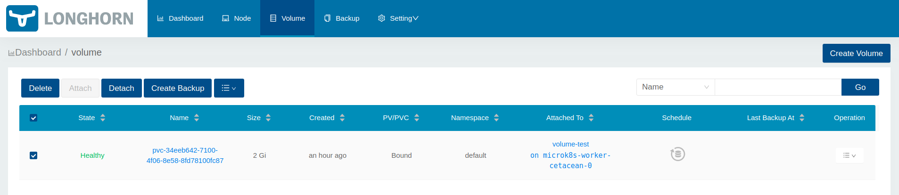

# Using Longhorn Storage

_[Longhorn](https://longhorn.io/docs/1.0.2/what-is-longhorn/) is a lightweight, reliable and easy-to-use distributed block storage system for Kubernetes._

## Pre-requisites

1.  https://longhorn.io/docs/1.0.2/deploy/install/#installation-requirements
2.  Core dns addon 
3.  Helm3 addon
4.  Ingress addon


## Steps: 

_Instructions taken from Longhorn [site](https://longhorn.io/docs/1.0.2/deploy/install/install-with-helm/)._  Tailored with MicroK8s addons.

1. Enable dns addon

```
microk8s enable dns
```

2. Enable helm3 addon

```
microk8s enable helm3
```

3. Add longhorn helm repo 

```
microk8s helm3 repo add longhorn https://charts.longhorn.io
```

4. Helm update

```
microk8s helm3 repo update
```

5. Install Longhorn

```
microk8s kubectl create namespace longhorn-system
# for testing use "/tmp/longhorn" as storage location
microk8s helm3 install longhorn longhorn/longhorn --namespace longhorn-system \
  --set defaultSettings.defaultDataPath="/tmp/longhorn" \
  --set csi.kubeletRootDir="/var/snap/microk8s/common/var/lib/kubelet"
```

6.  Check all pods are `Running`

```
microk8s kubectl -n longhorn-system get pods -A

NAME                                        READY   STATUS    RESTARTS   AGE   IP           NODE                           NOMINATED NODE   READINESS GATES
instance-manager-e-32b33e77                 1/1     Running   0          46m   10.1.39.5    microk8s-worker-cetacean-0     <none>           <none>
instance-manager-r-0d98aaf2                 1/1     Running   0          46m   10.1.39.6    microk8s-worker-cetacean-0     <none>           <none>
engine-image-ei-ee18f965-d2vjd              1/1     Running   0          46m   10.1.39.4    microk8s-worker-cetacean-0     <none>           <none>
engine-image-ei-ee18f965-58hsg              1/1     Running   0          46m   10.1.7.67    microk8s-controller-cetacean   <none>           <none>
longhorn-manager-9m49w                      1/1     Running   0          47m   10.1.39.3    microk8s-worker-cetacean-0     <none>           <none>
longhorn-manager-mvtcp                      1/1     Running   0          47m   10.1.7.66    microk8s-controller-cetacean   <none>           <none>
longhorn-manager-nxqjn                      1/1     Running   2          47m   10.1.98.65   microk8s-worker-cetacean-1     <none>           <none>
engine-image-ei-ee18f965-9zvlf              1/1     Running   0          46m   10.1.98.66   microk8s-worker-cetacean-1     <none>           <none>
instance-manager-e-8130572b                 1/1     Running   0          30m   10.1.98.70   microk8s-worker-cetacean-1     <none>           <none>
instance-manager-r-0b9655bc                 1/1     Running   0          30m   10.1.98.71   microk8s-worker-cetacean-1     <none>           <none>
instance-manager-r-361e6769                 1/1     Running   0          29m   10.1.7.70    microk8s-controller-cetacean   <none>           <none>
instance-manager-e-bc17fd46                 1/1     Running   0          29m   10.1.7.71    microk8s-controller-cetacean   <none>           <none>
longhorn-driver-deployer-658fdf45cc-8sf8r   1/1     Running   0          27m   10.1.7.72    microk8s-controller-cetacean   <none>           <none>
csi-attacher-79d88c7c98-7p9h2               1/1     Running   0          27m   10.1.39.7    microk8s-worker-cetacean-0     <none>           <none>
csi-attacher-79d88c7c98-8xbnn               1/1     Running   0          27m   10.1.98.73   microk8s-worker-cetacean-1     <none>           <none>
csi-attacher-79d88c7c98-xlw7j               1/1     Running   0          27m   10.1.7.73    microk8s-controller-cetacean   <none>           <none>
longhorn-csi-plugin-cqlqm                   2/2     Running   0          27m   10.1.98.74   microk8s-worker-cetacean-1     <none>           <none>
csi-resizer-d8487b59-rrxkl                  1/1     Running   0          27m   10.1.39.8    microk8s-worker-cetacean-0     <none>           <none>
csi-provisioner-5749f9cd4f-22gck            1/1     Running   0          27m   10.1.7.74    microk8s-controller-cetacean   <none>           <none>
csi-provisioner-5749f9cd4f-hrgnn            1/1     Running   0          27m   10.1.98.75   microk8s-worker-cetacean-1     <none>           <none>
longhorn-csi-plugin-6phhz                   2/2     Running   0          27m   10.1.39.9    microk8s-worker-cetacean-0     <none>           <none>
csi-resizer-d8487b59-z24rk                  1/1     Running   0          27m   10.1.7.75    microk8s-controller-cetacean   <none>           <none>
csi-resizer-d8487b59-8wwxd                  1/1     Running   0          27m   10.1.98.76   microk8s-worker-cetacean-1     <none>           <none>
csi-provisioner-5749f9cd4f-ccmwx            1/1     Running   0          27m   10.1.39.10   microk8s-worker-cetacean-0     <none>           <none>
longhorn-csi-plugin-cd4mx                   2/2     Running   0          27m   10.1.7.76    microk8s-controller-cetacean   <none>           <none>
longhorn-ui-7788d4f485-9649z                1/1     Running   0          26m   10.1.39.11   microk8s-worker-cetacean-0     <none>           <none>

```
7.  Enable Ingress addon

```
microk8s enable ingress
```

8.  Install Ingress Resource

```
cat <<EOF | microk8s kubectl apply -f -
apiVersion: networking.k8s.io/v1
kind: Ingress
metadata:
  name: longhorn
  namespace: longhorn-system
spec:
  rules:
  - host: longhorn-ui.geeks.sg
    http:
      paths:
        - path: /
          pathType: Prefix
          backend:
            service:
              name: longhorn-frontend
              port:
                number: 80
EOF
```

9. Access the Longhorn UI.

**Please note that this do not have Authentication in place.**

Go to your browser and access `http://longhorn-ui.geeks.sg` or whatever you have in your ingress.




10. Install sample pod using the longhorn PV

```
cat <<EOF | microk8s kubectl apply -f -
apiVersion: v1
kind: PersistentVolumeClaim
metadata:
  name: longhorn-volv-pvc
spec:
  accessModes:
    - ReadWriteOnce
  storageClassName: longhorn
  resources:
    requests:
      storage: 10Gi
---
apiVersion: v1
kind: Pod
metadata:
  name: security-context-demo
spec:
  securityContext:
    runAsUser: 1000
    runAsGroup: 3000
    fsGroup: 2000
  containers:
  - name: sec-ctx-demo
    image: busybox
    command: [ "sh", "-c", "sleep 10h" ]
    livenessProbe:
      exec:
        command:
          - ls
          - /data/lost+found
      initialDelaySeconds: 5
      periodSeconds: 5
    volumeMounts:
    - name: volv
      mountPath: /data
    ports:
    - containerPort: 80
  volumes:
  - name: volv
    persistentVolumeClaim:
      claimName: longhorn-volv-pvc         
EOF
```

11. Create files inside the pod

```
$ microk8s kubectl get pods -o wide
NAME                    READY   STATUS    RESTARTS   AGE     IP           NODE                         NOMINATED NODE   READINESS GATES
security-context-demo   1/1     Running   0          2m56s   10.1.39.13   microk8s-worker-cetacean-0   <none>           <none>

$ microk8s kubectl exec -it security-context-demo -- sh
/ # cd /data
/data # pwd
/data
/data # ls -l
total 16
drwx------    2 root     root         16384 Dec 11 08:20 lost+found
/data # echo "Hello" > my-file.txt
/data # cat /data/my-file.txt 
Hello
/data # 
```

## Backup to Digitalocean Spaces

Digitalocean Spaces is an S3 compatible object store.

1.  Create `Secret` which contains the DigitalOcean Spaces


```
cat <<EOF | kubectl apply -f -
# same secret for longhorn-system namespace
apiVersion: v1
kind: Secret
metadata:
  name: spaces-secret
  namespace: longhorn-system
type: Opaque
data:
  AWS_ACCESS_KEY_ID: `echo -n $DO_SPACES_ACCESS_KEY | base64 -w 0` # longhorn-test-access-key
  AWS_SECRET_ACCESS_KEY: `echo -n $DO_SPACES_SECRET_KEY | base64 -w 0`
  AWS_ENDPOINTS: `echo -n "https://nyc3.digitaloceanspaces.com/" | base64 -w 0`
  VIRTUAL_HOSTED_STYLE: dHJ1ZQ== # true
EOF
```

2. Setup in `General>Settings`



3. Create Backup

