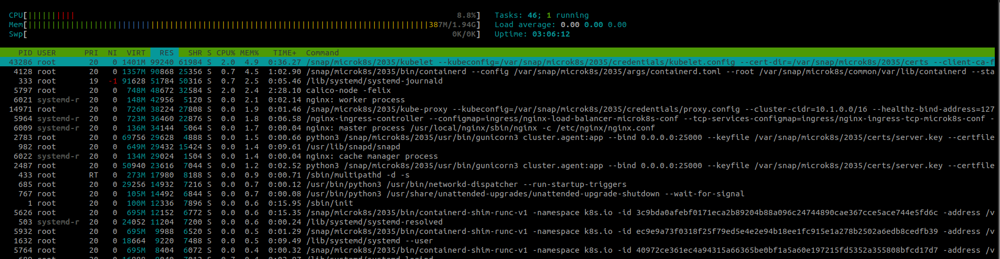
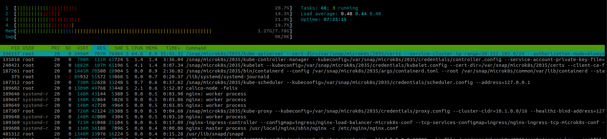

This document describes the steps on how to join a worker node only into your Highly Available MicroK8s.  

This has the main advantage that, you can avoid the resource overhead of the control plane.  The overhead can go up to GBs and several CPU cycles.  These cycles are best allocated to your workload instead of Kubernetes.

Before you begin, you need to have the following in place:

* An HA cluster, example 3 node HA MicroK8s cluster
* Load balancer to front the apiserver.

##  Setup a 3 node HA MicroK8s 

Follow the instructions in MicroK8s [documentation](https://microk8s.io/docs/high-availability).

## Load balancer IP

**Follow the steps below, if you need to use a cloud provider load balancer**

On each of your HA MicroK8s node, add the load balancer IP into the file `/var/snap/microk8s/current/certs/cs.conf.template`

For example:

```
[ req ]
default_bits = 2048
prompt = no
default_md = sha256
req_extensions = req_ext
distinguished_name = dn

[ dn ]
C = GB
ST = Canonical
L = Canonical
O = Canonical
OU = Canonical
CN = 127.0.0.1

[ req_ext ]
subjectAltName = @alt_names

[ alt_names ]
DNS.1 = kubernetes
DNS.2 = kubernetes.default
DNS.3 = kubernetes.default.svc
DNS.4 = kubernetes.default.svc.cluster
DNS.5 = kubernetes.default.svc.cluster.local
IP.1 = 127.0.0.1
IP.2 = 10.152.183.1
IP.99 = 167.172.5.46
#MOREIPS

[ v3_ext ]
authorityKeyIdentifier=keyid,issuer:always
basicConstraints=CA:FALSE
keyUsage=keyEncipherment,dataEncipherment,digitalSignature
extendedKeyUsage=serverAuth,clientAuth
subjectAltName=@alt_names

```
Note that **IP.99 = 167.172.5.46** is the Load balancer IP

## Simple Load Balancer per node

The steps below uses a load balancer installed on each node.

In this step, we will use [`Traefik`](https://doc.traefik.io/) to load balance between the Kubernetes ApiServer.

* Download [Traefik binary](https://github.com/traefik/traefik/releases), and place it in to `/usr/local/bin` directory.
* Configure traefik.yaml
  
  You need to create the `traefik.yaml` configuration file in `/etc/traefik/traefik.yaml`, for example:

  ```yaml
  ## Static configuration
  entryPoints:
    apiserver:
      address: ":16443"
  providers:
    file:
      filename: /etc/traefik/providers.yaml
      watch: true
  ```
  Then configure the provider into the location `/etc/traefik/provider.yaml` (as shown above).

  ```yaml
  tcp:
  routers:
    Router-1:
      # Listen to any SNI
      rule: "HostSNI(`*`)"
      service: "kube-apiserver"
      tls:
        passthrough: true
  services:
    kube-apiserver:
      loadBalancer:
        servers:
        - address: "10.130.0.2:16443"
        - address: "10.130.0.3:16443"
        - address: "10.130.0.4:16443"
  ```

  Each of the address represents the IP address and port of the apiservers.

* Start traefik, or setup a systemd service for traefik

## Install MicroK8s

On your worker node, install MicroK8s like usual.

### For versions 1.20

```
snap install microk8s --classic --channel 1.20/stable
```

### Stopping the services

You need to stop all the services on this worker node.

#### For versions 1.19 or 1.20

```
systemctl stop snap.microk8s.daemon-apiserver
systemctl stop snap.microk8s.daemon-apiserver-kicker.service 
systemctl stop snap.microk8s.daemon-controller-manager.service 
systemctl stop snap.microk8s.daemon-control-plane-kicker.service 
systemctl stop snap.microk8s.daemon-scheduler.service 
systemctl stop snap.microk8s.daemon-kubelet.service 
systemctl stop snap.microk8s.daemon-proxy.service
```
#### For kubelite version

Stop the kubelite service

```
systemctl stop snap.microk8s.daemon-kubelite.service
```

### Token generation and known_tokens

On each worker node run the following:

Example:

```
# openssl rand -base64 32 | base64
KzVIdjBkUWFNYStQc01xb09lMXM1VEFRUVAxSHIxQ3I5UHk5bjZiSVdidz0K
```
_Keep the generated random string._

On each of your **control plane** nodes, edit the file `/var/snap/microk8s/current/credentials/known_tokens.csv` and add the following.

```
KzVIdjBkUWFNYStQc01xb09lMXM1VEFRUVAxSHIxQ3I5UHk5bjZiSVdidz0K,system:kube-proxy,kube-proxy
KzVIdjBkUWFNYStQc01xb09lMXM1VEFRUVAxSHIxQ3I5UHk5bjZiSVdidz0K,system:node:worker-1,kubelet-1,"system:nodes"
```

Restart each control plane api server.

`systemctl restart snap.microk8s.daemon-apiserver`

### Copy certificates to the worker node

```console
scp root@controlplanenode:/var/snap/microk8s/current/certs/ca.crt /tmp/ca.crt
scp root@controlplanenode:/var/snap/microk8s/current/credentials/kubelet.config /tmp/kubelet.config
scp root@controlplanenode:/var/snap/microk8s/current/credentials/proxy.config /tmp/proxy.config

#copy the files to the worker nodes
scp /tmp/ca.crt root@workernode:/var/snap/microk8s/current/certs/ca.crt
scp /tmp/kubelet.config root@workernode:/var/snap/microk8s/current/credentials/kubelet.config
scp /tmp/proxy.config root@workernode:/var/snap/microk8s/current/credentials/proxy.config

```

### Modify the config tokens

Before starting the kubelet and proxy, you need to modify the token located in `/var/snap/microk8s/current/credentials/kubelet.config` and `/var/snap/microk8s/current/credentials/proxy.config`.


**If you are using the [node based simple load balancer](#simple-load-balancer-per-node), simple use `server: https://127.0.0.1:16443` in the `/var/snap/microk8s/current/credentials/kubelet.config` and `/var/snap/microk8s/current/credentials/proxy.config`**


As an example:

```yaml
apiVersion: v1
clusters:
- cluster:
    certificate-authority-data: LS0tLS1CRUdJTiBDRVJUSUZJQ0FURS0tLS0tCk1JSURBVENDQWVtZ0F3SUJBZ0lKQUpGcnFTaDNvTThWTUEwR0NTcUdTSWIzRFFFQkN3VUFNQmN4RlRBVEJnTlYKQkFNTURERXdMakUxTWk0eE9ETXVNVEFlRncweU1UQXlNVEl3TVRBME5ERmFGdzB6TVRBeU1UQXdNVEEwTkRGYQpNQmN4RlRBVEJnTlZCQU1NRERFd0xqRTFNaTR4T0RNdU1UQ0NBU0l3RFFZSktvWklodmNOQVFFQkJRQURnZ0VQCkFEQ0NBUW9DZ2dFQkFONTh6V2JlODdPK0FDUE9sbnlJVnlUWU0zaHZDTWQ0VGNucnVQcFllVHhwSzlLT1o5djEKc0pYeWNZejBEQ293TThnUEcydlRSRWI5UHg2OU0zZmhWV053Z0hMLzhUZnlKTkxpZUE1SmhtMXcrMUdOQkxvSgpkOEdXTE1LaDcwK1JWQlNzblhLSXRxUTY0aFhoZVVZV1J3QW1IU0ZCL3ZkL1B4ZWwvelN6M3loRXA0YXlhbjhMCjVVUEVpL0tkWVdwK0dJTWpJSzROQmEzMW9oVlYwQnBlLzlzTGdlNEcyNzM0em50NjdZSS9seWg4LzR1UnpuZnEKTndHRVdEeDhlV1ZWNjMrUWltNmIzRklUdG5nS0Y3UUlaV2hXN0xzMlZ2aGkrMGp1RFFSRmZNY1JYaXJpZ3lCMwoxNURzWnAwMFFzb3VQTHVPRGRlbE9waVdQR1hvUzlMSmJpY0NBd0VBQWFOUU1FNHdIUVlEVlIwT0JCWUVGSnBRCnlEaGJGK3hnSDJOL216ZjdQanpvNDdzak1COEdBMVVkSXdRWU1CYUFGSnBReURoYkYreGdIMk4vbXpmN1Bqem8KNDdzak1Bd0dBMVVkRXdRRk1BTUJBZjh3RFFZSktvWklodmNOQVFFTEJRQURnZ0VCQUZ3SDNvOU9hUnQ0NDlNdQppRUxBenRKQVE1ZHhjSWM2STBUdkhvVVBYOWwvemJRQ3hPQ3ExT1Z4a2M0TXRHTXA3TktlMDZ2UWFVSzAzVnhTCm5yMktYeFdwckVxNGFTMUdHc21vOEVDQUtZOEpUVXpjUkNBa0lNcjBPcHlWM0RKc3NXNWVHRGVvaVJESGY1RnAKc3d3VUZ4REVSWFFlb0ZNV1FDYWJMQTNzdVl0enBQZVdWLzJQeHVsbEJMaXBseFhEMk8wcllLUHVzT0FTeDk1MApVSnRTMmwzTFpENXRoTUM2eG1LT2FYSDNhT0FLWjNZMEhVWUN6VGhPaUdLMXV6cDFIcjI5LzRweUQrbGVVeHNyCkZWMDZYZ1JESStYNFZTaWNVYVEzeG16U1EyYm1qVVFNc3RTdytId0VaR2tRTS9OZ1BqaURxZ2tqbHhoVDJndmQKWnFLMFhZRT0KLS0tLS1FTkQgQ0VSVElGSUNBVEUtLS0tLQo=
    server: https://your-load-balancer-ip or https://127.0.0.1:16443 if using simple node based LB
  name: microk8s-cluster
contexts:
- context:
    cluster: microk8s-cluster
    user: kubelet
  name: microk8s
current-context: microk8s
kind: Config
preferences: {}
users:
- name: kubelet
  user:
    token: KzVIdjBkUWFNYStQc01xb09lMXM1VEFRUVAxSHIxQ3I5UHk5bjZiSVdidz0K
```


### Additional Kubelet configuration

When enabling the DNS,  you need to start the worker node's kubelet with these additional arguments/parameters.

From the file `/var/snap/microk8s/current/args/kubelet`  add at the bottom of the file the following.

```
--cluster-domain=cluster.local
--cluster-dns=10.152.183.10
```

There's one last file you need to create on each worker node.  You need to create a file called `
/var/snap/microk8s/current/var/lock/clustered.lock`. The importance of this file is to make sure that the control plane services such as apiserver, controller manager and scheduler do not start when the snap is updated or when you do a `microk8s stop` and `microk8s start`.

### Start the Kubelet and Kube-proxy

#### Prevent the control plane from starting 

The procedure above will not prevent the control plane from starting when the node is restarted or when the snap is refreshed.

Create a file `/var/snap/microk8s/current/var/lock/clustered.lock` on each worker node.

#### Starting the service on 1.19 or 1.20

In each of the worker node

```
systemctl start snap.microk8s.daemon-kubelet.service
systemctl start snap.microk8s.daemon-proxy.service
```

#### Starting the service on kubelite version

```
systemctl stop snap.microk8s.daemon-kubelite.service
```

## Check the cluster

From one of the master node.

Cordon off the control plane nodes.

`microk8s kubectl cordon mk8s-cp-01 mk8s-cp-02 mk8s-cp-03`


```console
# microk8s kubectl get no -o wide
NAME         STATUS                     ROLES    AGE     VERSION                     INTERNAL-IP   EXTERNAL-IP   OS-IMAGE             KERNEL-VERSION     CONTAINER-RUNTIME
mk8s-cp-02   Ready,SchedulingDisabled   <none>   6d23h   v1.20.2-36+a377b7383d340b   10.130.0.3    <none>        Ubuntu 20.04.1 LTS   5.4.0-51-generic   containerd://1.3.7
mk8s-wk-01   Ready                      <none>   6d23h   v1.20.2-36+a377b7383d340b   10.130.0.5    <none>        Ubuntu 20.04.1 LTS   5.4.0-51-generic   containerd://1.3.7
mk8s-cp-01   Ready,SchedulingDisabled   <none>   6d23h   v1.20.2-36+a377b7383d340b   10.130.0.2    <none>        Ubuntu 20.04.1 LTS   5.4.0-51-generic   containerd://1.3.7
mk8s-cp-03   Ready,SchedulingDisabled   <none>   6d23h   v1.20.2-36+a377b7383d340b   10.130.0.4    <none>        Ubuntu 20.04.1 LTS   5.4.0-51-generic   containerd://1.3.7

```

Below shows the utilization of kubelet and kube-proxy.  Running on a 1 CPU and 2 GB VM.  As you can see, the node is very much dedicated to your workloads and not kubernetes.



Compare that to a control plane node resource usage.

 

Now you can run MicroK8s on a resource constrained environment. Profit!!!